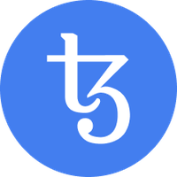

#  tezos-alert 

A NodeJS application which uses https://api.tzkt.io/ to check for changes in a Tezos account and notify these changes by direct-messaging you on Discord.<br>


# Usage
When the Discord bot is added to your server, whenever your Tezos account balance changes (checked every minute due to API limits), you'll receive a DM from your bot.
But you can also send your Bot a DM:
* Get your current Tezos address balance: `!balance`
* Change the Discord User ID (only for testing purposes): `!userid your-user-id`
* Change the Tezos address (only for testing purposes): `!tzaddress your-tezos-address`

# Install
* run `npm install` inside working directory
* create a copy of `config.json.example` and rename it to `config.json`.
* `discord_token`: copy and paste the Discord token (see Discord setup below)
* `discord_userID`: copy and paste your Discord User ID (https://techswift.org/2020/04/22/how-to-find-your-user-id-on-discord/)
* `discord_prefix`: pick a prefix that does not exist in your current Discord server. If you don't have any bots, you can use the default "!".
* `tezos_address`: the Tezos address you want to get notifications for
* run the program with `node ./src/index.js` 
* keep it running while your account balance changes to see it in action or host it on a live server

# Discord Setup
```
Go to https://discord.com/developers/applications
Click New Application
Give it a name like "Tezos account balance"
Give it a description
Upload an app icon
In the menu section go to Bot to add a Bot user
Click Add Bot
Copy the token and paste it in config.json into the `discord_token` value
Go to the BOT menu and enable both "Privileged Gateway Intents" intents.
In the menu section go to OAuth2 - URL Generator
In the scopes section choose "bot"
In the bot permissions section choose "Send Messages"
---
Copy the URL in the "generated url" section, paste it in your browser, pick the correct server the bot needs to be added to.
```

# install Digital Ocean droplet
Create a new droplet in the Digital Ocean interface, set up SSH keys and connect to your droplet.
```
# install node, it will run run apt-get update automatically:
curl -sL https://deb.nodesource.com/setup_current.x | sudo -E bash -
sudo apt-get install -y nodejs
# install pm2 globally
sudo npm install -g pm2
# sudo apt install -y git-all
sudo apt install -y git
git clone https://github.com/vincentsijben/tz-alert.git /opt/
cd /opt/tz-alert/
# install the project dependencies
npm i
# create the config file
mv config/config.json.example config/config.json
# copy paste your token
```
to start:
```
pm2 start /opt/tz-alert/src/index.js --name tz-alert
# start pm2 after reboot
pm2 startup
pm2 save
# to see logs
pm2 logs tz-alert
# check status
pm2 status tz-alert
# to remove
pm2 delete tz-alert
```
If there's an update in the code, make sure it's pushed to the online repository and run this on the server:
```
cd /opt/tz-alert/
git stash
git pull
pm2 delete tz-alert
pm2 start /opt/tz-alert/src/index.js --name tz-alert
pm2 save
```


### Read
* Best practices: https://baking-bad.org/blog/2020/09/28/tezos-explorer-api-tzkt-filter-data-on-the-api/
